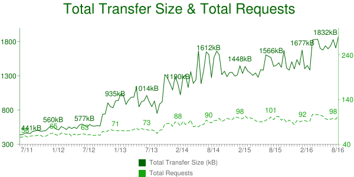
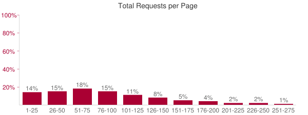
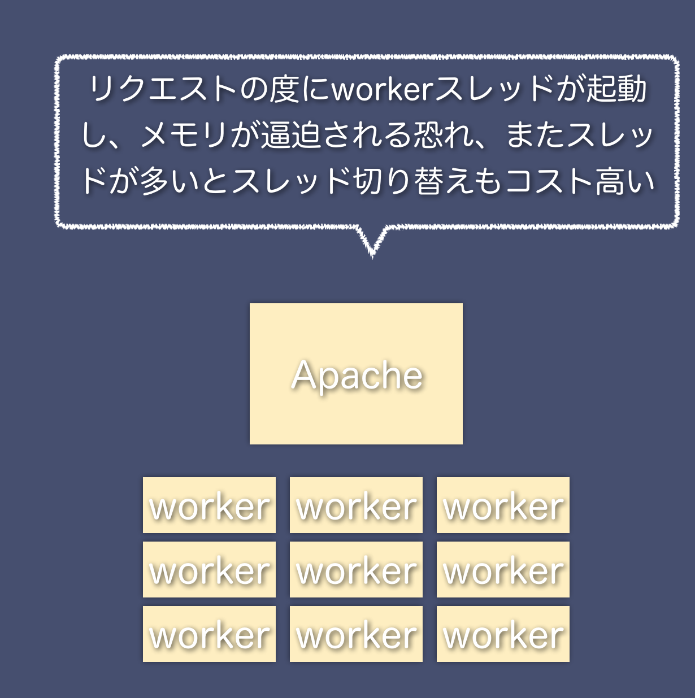
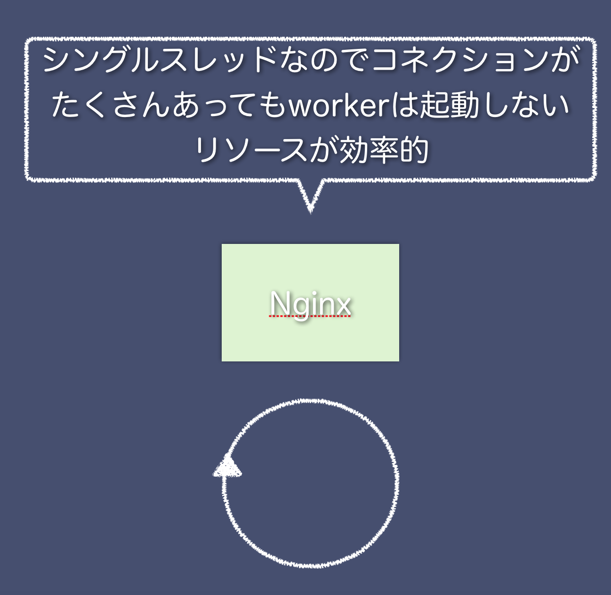
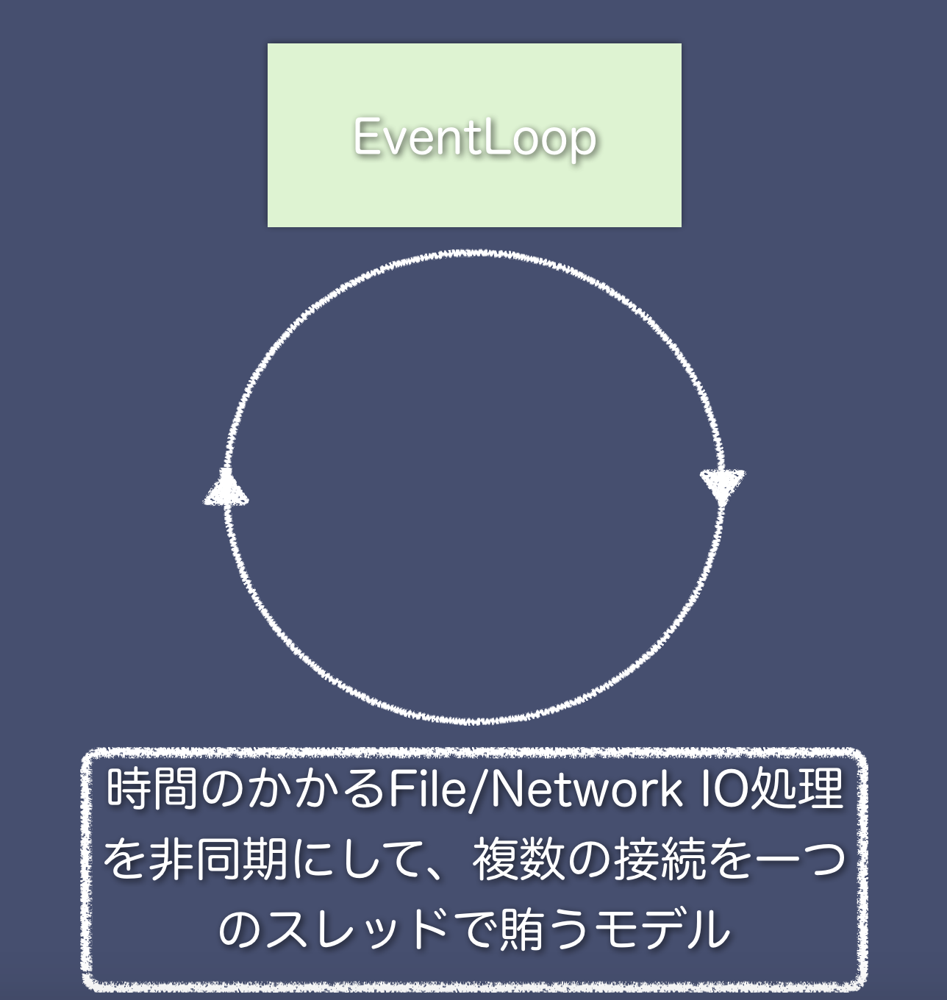
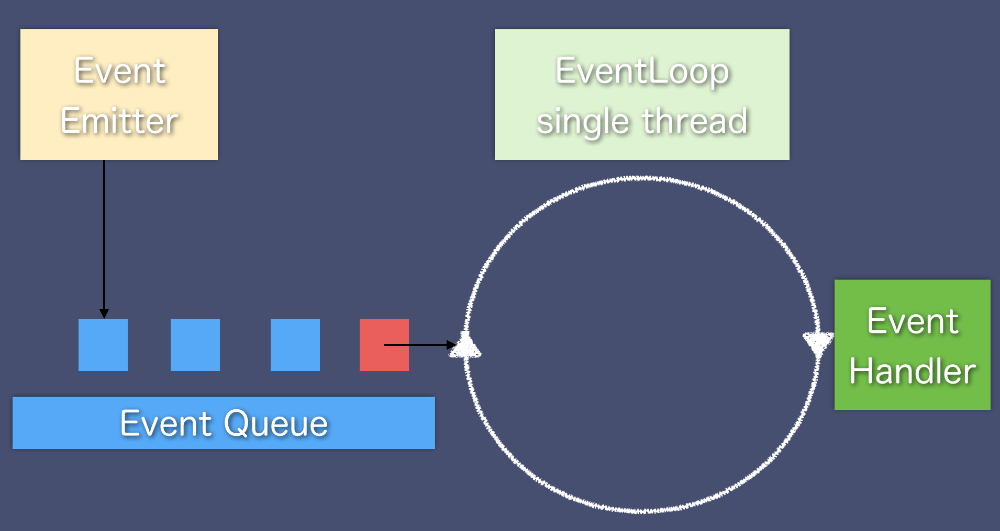

# Node.js とは

Node.js は `JavaScript` を実行するための環境を指します。「サーバサイド JavaScript 」と表現されることが多い Node.js ですが、用途はサーバだけではなく、 IoT やフロントエンドのビルドシステム、Electron などのクライアントアプリなど、様々な用途で利用されることが多くなってきました。今回は原点に帰って、サーバとしての Node.js の解説をします。

Node.js には他のスクリプト言語と異なり、イベントループや JIT 等のいくつかの特徴があります。これらの特徴が何なのか、また何故この特徴が必要だったのかについて、本章で述べます。

本章では主に下記のことについて記述します。

- 昨今の Web アプリケーションにおけるリクエスト数の増加
- C10K 問題
- イベントループモデル

## リクエストの増加

過去の数年前と比較して、 Web アプリケーションのリクエストの数は飛躍的に増えています。それを裏付けるデータがいくつか存在します。以下の図は HTTP リクエストの数とレスポンスデータの量が2011年から現在(2016年8月)まででどの程度増えたのかを示しています。


[httparchive.org より抜粋](http://httparchive.org/trends.php?s=Top100&minlabel=Jun+1+2011&maxlabel=Aug+1+2016#bytesTotal&reqTotal)

グラフを見ると、リクエスト数が5年前と比較して、伸びていっている事がわかります。　

また、別な角度からデータを見てみましょう。以下の図は１つのサイトあたりのリクエストの数のうち、平均でどのくらいリクエストを発行しているページがあるかを割合で示しています。


[httparchive.org より抜粋](http://httparchive.org/interesting.php#reqTotal)

グラフを見ると、大体１つのページに付き、51-75ものリクエストをしているページが一番多いことがわかります。

これらのデータから分かることとして、リクエストは伸び続ける傾向にあり、また１つのページにおけるリクエストの数も多いことが分かります。 Web アプリケーションといっても数年前とは異なり、よりリッチでアクティブなものが増えてきています。

## C10K 問題

リクエスト数が増えるとどんな問題が起きるのでしょうか。この問題は 2000 年初頭の記事である、 "The C10K Problem" に記述されています。単純に言えば、クライアントが 10000 台いると、サーバーが処理できなくなってしまう問題を指しています。 2000 年初頭の Web サーバは `Apache` が主流でした。当時の `Apache` はリクエストを受け付ける度にスレッドもしくはプロセスを起動するという方式を取っていました。10000台のクライアントから同じタイミングで接続するとどうなるでしょうか。プロセスにせよ、スレッドにせよリクエストの度に起動していたのでは10000ものリクエストは捌ききれません。リクエスト数が増加している現在ではクライアントは 10000 も必要なく、数百程度でも同様の問題が発生します。



これに対応するために作成されたのが `nginx` です。当初主流だった `Apache` がスレッドやプロセスを起動するのに対して、スレッドは 1 つでネットワークやファイル I/O の時だけ非同期処理を行う、イベントループモデルと呼ばれるモデルを採用しました。これにより、より低リソースで多くのリクエストを処理することが可能になりました。



## イベントループモデル

もうすこしイベントループモデルについて深掘りをしておきましょう。前節で `nginx` ではイベントループモデルを採用し、それが C10K 問題を解決するための方法として広まったという解説をしました。イベントループモデル、というのは本質的に何なのかを解説します。



イベントループモデルを理解するにはイベント駆動型プログラミングを理解する必要があります。イベント駆動型プログラミングは実際には GUI を作る際によく利用されます。所謂 "クリックされた" であったり、 "データを取得した" といったイベントを契機としてプログラミングをする手法を指します。

ブラウザの JavaScript ではイベント駆動で下記のような記述を行います。

```javascript
const button = document.getElementById('button');
// ボタンに対して click のイベントを登録する
button.addEventListener('click', (e) => {
  // クリックされたらコールバック関数が発火し、処理が実行される
});
```

イベント駆動型プログラミングはこのように何らかのイベントを登録（listen）し、登録されたイベントが実行されたタイミングでコールバック関数が実行されます。このようにイベントを起点に処理が実行されるプログラミング手法のことをイベント駆動型プログラミングと呼びます。

イベントループはこのイベント駆動型におけるイベントを待機するループのことを指します。先ほどの図をもう少し細かく表記すると下記のようにイベントが発生したらキューイングし、その都度ループが回りながらイベントを待ち受け、キューから受け取りながら処理するような形になります。



イベントループモデルだと Web アプリケーションにとってどんな都合が良いのでしょうか。 Web アプリケーションはその特性上、ログ記述やデータベース読み込み、また外部API呼び出しといった入出力処理が数多く発生します。これらのすべての処理はイベントループモデルでは、イベントとして扱われます。つまり、ファイルを読み込んだ事もイベントであれば、ネットワーク上のリソースに値を書き込んだ処理もイベントです。これらの処理はメモリやCPUキャッシュへの書き込みと比較して格段に遅い処理になります。

|I/O|cycles|
|:---------|:----------|
|CPU L1 Cache|3 サイクル|
|CPU L2 Cache|14 サイクル|
|RAM|250 サイクル|
|ディスク|41,000,000 サイクル|
|ネットワーク|240,000,000 サイクル|

上記の表はそれぞれの I/O において CPU サイクルの数を示しています。 CPU/RAM の I/O では 3-250サイクルなのに対して、ディスク I/O やネットワーク I/O では飛躍的にサイクル数が上がっていることが見てわかると思います。

イベントループモデルでは、ディスクやネットワーク I/O での処理は全てイベントとして扱われ、処理はブロックされません。つまりイベントがキューに積まれるだけで、実際のメインスレッドをブロックするわけではなく、従来のスレッド型やプロセスをフォークするモデルに比べてスケールしやすい仕組みであると言えます。

## Node.js におけるイベントループモデル

`nginx` がイベントループモデルを採用し、それから他の言語もイベントループモデルを採用するようになります。 Perl の `AnyEvent` や Ruby の `Event Machine` 、 Python の `Twisted` といったようにイベントループモデルを持った仕組みが検討されていきます。

`Node.js` もこれらのイベントループモデルと同時期にリリースされます。他のイベントループを持った言語と違ったのは「組み込みのブロッキングI/O処理が **なかった** 」ことです。他の言語はネットワークやファイルアクセスの際に既にブロッキングで処理する仕組みが存在します。 `JavaScript` にはこれらの仕組みが元から存在せず、またブラウザで行われているイベントループの考え方がそのまま受け入れられる土台があったので、他の言語と比較してもより容易に受け入れられるようになりました。

これにより、 JavaScript という言語を持ったイベントループモデルで動作する実行環境として `Node.js` が誕生しました。

## まとめ

本章では、リクエストが増加しつつある現状と2000年初頭に提言されていた C10K 問題について記述し、その解法としてのイベントループモデルについて記述しました。次章では Node.js がどういう実行環境を持っているのかを記述します。
