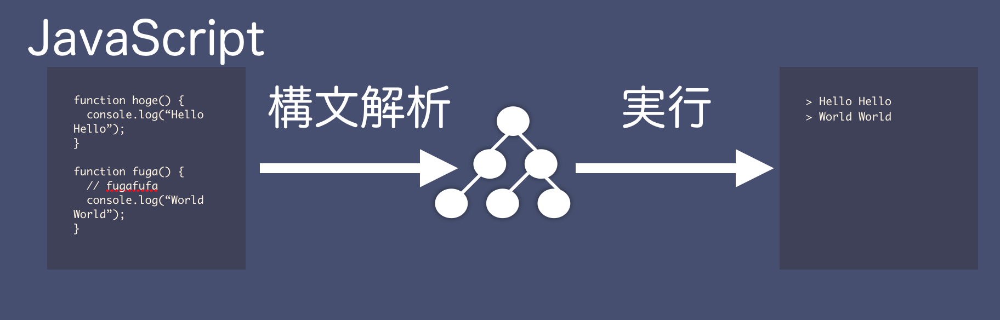
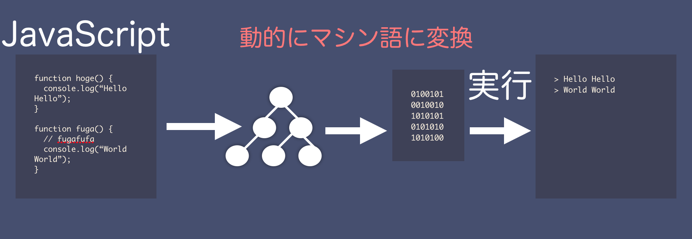
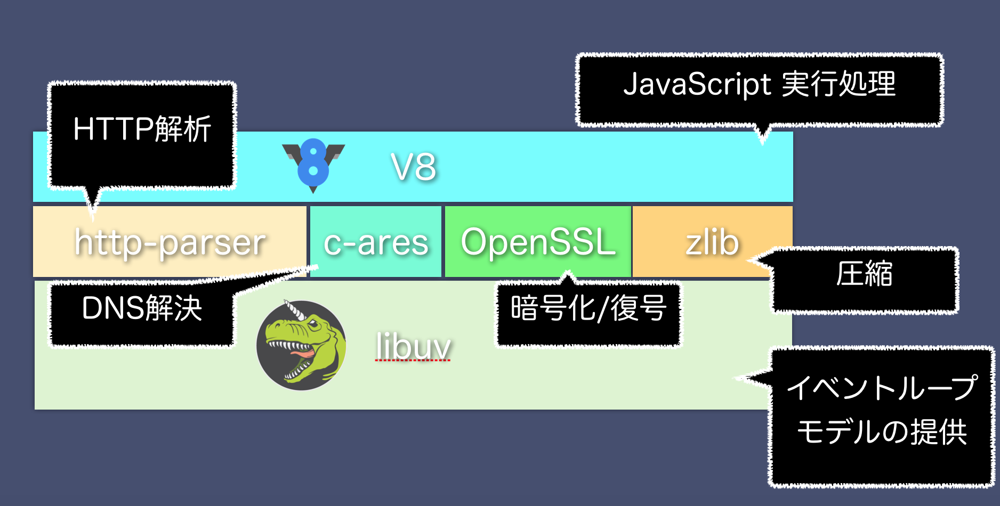

# Node.js と既存のシステムの違い

前章では Node.js が採用しているイベントループモデルについて簡単に触れました。本章では、今回のテーマである「 Web サーバがどうやって動いているのか」を Node.js の側面から展開し、既存のシステムとの違いについて記述します。

本章では主に下記のことについて記述します。

- Node.js がどうやって動いているのか
- Node.js の技術構成
- 既存の Web サーバとの違い

## Node.js の http サーバがどうやって動いているのか

Node.js はどうやって http サーバを構築しているのでしょうか。 本節では Node.js の中身を解説します。主に下記のことについてここでは解説します。

- イベントループモデルをどう構築しているか
- HTTP Parser
- v8 による JavaScript 処理

### イベントループモデルを Node.js はどう構築しているか

前節ではリクエストが増えつつある現状とそのリクエストを捌くためにイベントループモデルが重要であるという解説を行いました。 Node.js はイベントループモデルを構築するためにその内部に `libuv` と呼ばれるプラットフォームを利用しています。 

イベントループモデルのところで軽く触れましたが、ネットワークプログラミングをする際にナイーブに実装するとクライアントがリクエストしてからサーバがレスポンスを返すまでブロックする作りとなり、ネットワークサーバとしてスケールしにくい実装になってしまいます。これを解決するためのいくつかの方法があります。

- 多重プロセスによる方法 (prefork model, Perl, PHP, Ruby などが採用)
- 多重スレッドによる方法 (multi-thread model, Java などが採用)
- I/O 多重化による方法 (multiplex i/o model, Node.js などが採用)
- 非同期 I/O による方法 (asynchronous i/o model, 一部 nginx の内部で採用)

Node.js では I/O 多重化による方法を基本的に採用しています。I/O多重化による方法と非同期 I/O による方法は似ていますが、厳密には異なるものです。

上記の図は [Boost application performance using asynchronous I/O](http://www.ibm.com/developerworks/linux/library/l-async/) という IBM の非同期 I/O 紹介記事から拝借しています。

`JavaScript` のレイヤから見た時はそこを意識することはありませんが、今回は「Webサーバがどうやって動作するのか」「Node.js が他のサーバと異なる箇所は何か」をテーマとしているため、少し深ぼります。

I/O 多重化による方法は I/O 処理自体が多重化、つまり複数実行できるようになり、ファイルディスクリプタレベルで「読み込み準備が整っているか」といった状況の監視を行います。しかし、実際の I/O 処理をする際にはブロッキングで処理が行われます。非同期 I/O による方法は I/O 処理自体を非同期にするカーネルの機能を活用して作られたもので、ユーザー空間においては I/O 処理はブロックされません(カーネル空間での I/O 処理はブロックされる可能性があります)。

Node.js 開発当初から現在のところ、 非同期 I/O が Linux や BSD 系 OS で動作保証できず、安定した処理を求めて Node.js では基本的に I/O 多重化による方法が取られています。

I/O 多重化も実行環境によっていくつか実現方法が存在します。主に OS の種類によって提供されるものが異なりますが、 Linux や BSD 環境では代表的なものとして `select` 、 `poll` 、 `epoll` 、 `kqueue` といったシステムコールが存在します。各種システムコールについて深く言及するのは今回の範囲を超えるので控えますが、 I/O を呼び出す際にシステムコールとして効率的なのは `epoll` と `kqueue` です。 `select` や `poll` はそこまで効率的でないため、 Node.js では採用されていません。 Windows では `IOCP` という独自のシステムコールを利用します。

`libuv` では、 Linux の場合は `epoll` を活用し、 Mac 等の FreeBSD 系 OS の場合は `kqueue` を活用、 Windows の場合は非同期 I/O である `IOCP` を活用する、といったようにクロスプラットフォームでの効率的な I/O 操作を提供してくれます。

また同様に `libuv` ではイベントをキューイングする機構とそれをキューから受けて処理を実行するイベントループの機能、 `TCP` や `UDP` の操作、 ファイルシステムを操作する機能も備えています。そのため `libuv` は `libev` や `libeio` のようなI/Oライブラリではなく、高機能なイベントループのプラットフォームとして構築されています。

### HTTP を処理する仕組み

前節で `libuv` は効率的な I/O 処理と TCP/UDP 操作、イベントループを提供してくれるプラットフォームであるという解説をしました。 Node.js を Web サーバとして構築する際にはテキストで書かれた HTTP をパースする必要があります。 "パース" というのはテキストで書かれた情報をプログラミングからアクセスしやすい形に変換する事です。

Node.js では、 [`http-parser`](https://github.com/nodejs/http-parser) という HTTP のリクエスト/レスポンスの情報をパースするためのライブラリが存在します。 `http-parser` と `libuv` を組み合わせるだけで簡単な Web サーバを作ることが可能です。試しに作ると雰囲気がわかると思うので、作ってみたいという方が居れば下記の URL から参考にしてください。

[uv_http_server](https://github.com/yosuke-furukawa/uv_http_server)

### V8 による JavaScript 実行する仕組み

V8 は Google が作っている JavaScript 処理エンジンです。Google Chrome / Android Browser の中で動作しています。 V8 は中に様々な最適化機能を持っていますが、特徴的なのは JIT (Just in Time) コンパイラを持っていることでしょう。 JIT コンパイラというのは、 実行中にホットスポットと最適化ポイントを発見して、コードをその場で最適化する機能です。 これにより、 V8 の JavaScript は過去のエンジンと比較して、格段に高速化されています。

JIT の機能がない場合は、 JavaScript を構文解析し、それからインタプリタとして実行します。

JITの機能がある場合、 JavaScript を構文解析した後、ホットスポットと最適化ポイントを見つけてその部分を機械語に変換します。

## Node.js の技術構成

前節で Node.js の中を少し解剖し、中身がどういう作りになっているかを解説しました。

この他にも `ssl/tls` を構築するためのモジュールである、 `OpenSSL` や DNS への問い合わせを行う `c-ares` 、 データ圧縮のための `zlib` といったモジュールが組み込まれています。全てを含めると下記のようになります。

Node.js を使う上ではそれぞれを深く知る必要はありませんが、どのモジュールが何の目的で動いているのか程度は知っておいた方が良いでしょう。

## 既存の Web サーバとの違い

Node.js は前述したとおり、これまでのサーバとは異なるマルチタスクの仕組みを持っています。本節では、他のサーバとNode.jsの比較を行います。

Node.js が持っているイベントループモデルと I/O 多重化の仕組みは Node.js の核となる機能です。しかし、 CPU リソースを大量に消費するような処理が行われてしまうと、イベントループが止まってしまい、新しいイベントを受け付ける事ができなくなってしまいます。そのため、 Web サーバ内で　CPU 負荷をかけるような処理をするのは不向きです。

その代わり、大量にクライアントからの接続を維持できるのが利点です。これらを踏まえて次項からは 多重プロセスモデルと多重スレッドモデルとの違いを記述します。

### 多重プロセスモデルとの違い

多重プロセスモデルはリクエストが発生する度にプロセスをフォークするモデルです。 CGI と呼ばれる機構はこの方法を採用しています。 Perl 、 PHP といったスクリプト言語ではよく利用されているモデルになります。最も単純でそれ故に古くからこの方法が使われています。しかし、1つのリクエストで1つのプロセスを実行する形になるため、プロセスが起動できる分までしかリクエストは同時に処理されません。

通常では、毎回リクエストが発生する度にプロセスを起動していたのではプロセスが起動するまでのコストがかかります。 基本は事前に接続可能な分だけを fork しておいて、リクエストが来る度に fork 済みのプロセスに割り当てる prefork という方法が使われています。ただし、その場合であっても同様にプロセスが起動できる分までしか同時に捌くことはできません。 

多重プロセスモデルに対して Node.js は基本的にはシングルスレッドで実行されます。さらにマルチコアを使ってより多くのリクエストを処理したい場合は、 `cluster` と呼ばれる機能を利用します。これは前述した prefork と同じく、事前にワーカープロセスを複数起動しておく方法です。

多重プロセスモデルは仕組みが単純であるが故に、昔から実現されていて、運用実績が多いです。 `prefork` モデルやプロセスを使い回す事で `fork` のコストを下げる仕組みも提供されています。ただし、一台のサーバで同時に接続できる数は原理的にイベントループモデルより少ないです。

### 多重スレッドモデルとの違い

多重スレッドモデルはリクエストが発生する度に OS のネイティブスレッドを起動します。Java などが利用しているモデルです。これに対して Node.js はシングルスレッドです。その代わり イベントループモデルを採用し、 I/O 多重化により、効率的な I/O 操作を実現しています。

このような多重スレッドモデルは短時間で接続が切れて、あまり同時接続数が多くないサーバの用途には向きますが、同時接続数が多く、長時間接続がつながっているようなサーバの場合は スレッドが増えてしまうことによるメモリの増加とコンテキストスイッチのコストが高くなります。

また、現在は OS のネイティブスレッドを起動せずに、アプリケーションのレイヤで仮想的なスレッドを持ってコンテキストスイッチのコストを減らし、より効率的に同時接続数を増やす軽量プロセスによる方法も存在します。 `golang` や `Erlang` はこの軽量プロセスによるモデルを利用しています。

多重スレッドモデルはスレッドを効率的に利用するモデルです。多重プロセスモデルよりもたくさんのリクエストを裁くことが可能ですが、ネイティブスレッドをリクエストの度に作るような仕組みを持つ場合、大量にリクエストを発行されると逆に非効率的になってしまうため、仮想的なスレッドの機能を持って対処する方法が存在します。

## まとめ

本章では、 Node.js がどうやって動くのか、 Node.js の技術構成、 他のモデルとの違いについて解説しました。 Node.js には利点もありますが、欠点も存在します。各種モデルとの違いを踏まえて適材適所で利用できるようにしましょう。 

# 参考

- http://www.ibm.com/developerworks/library/l-async/
- https://github.com/nodejs/http-parser
- https://github.com/yosuke-furukawa/uv_http_server
