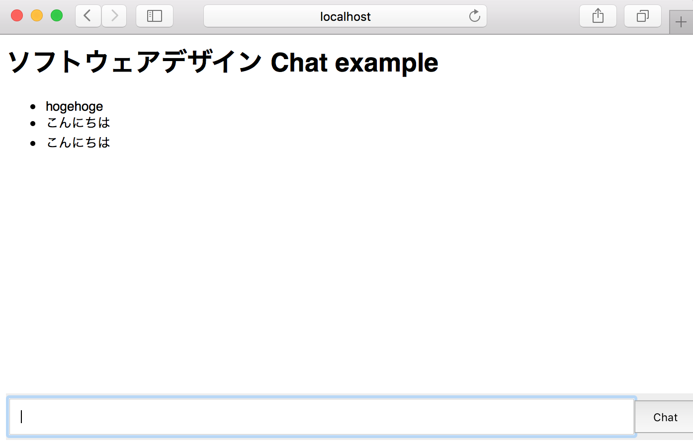

# Node.js で作るシステム

前章では Node.js がどういう仕組みで動作していて、さらに利点と欠点について解説しました。本章では、実際に Node.js のサーバを作成し、どういう目的のシステムに向くのかを解説します。

本章では主に下記のことについて記述します。

- Node.js で作る HTTP サーバ
- Node.js/WebSocket で作るリアルタイムチャット

## Node.js で作る HTTP サーバ

実際に Node.js で HTTP サーバを構築してみましょう。 Node.js には既に組み込みで `http` モジュールが存在しています。これを使って簡単な HTTP サーバを構築してみましょう。 Node.js のバージョンは執筆当時の最新版である `v6.4.0` を使っています。

```javascript
const http = require('http');

const server = http.createServer((req, res) => {
  res.end(process.version);
});

server.listen(8080);
console.log('listening on 8080');
```

これを `app.js` で保存して、 `node app.js` で起動させます。

```
$ node app.js
listening on 8080
```

ブラウザなどで確認すると、実際の Node.js のバージョンが出力されると思います。

```
$ curl http://localhost:8080/
v6.4.0
```

前章で、 Node.js はイベント駆動型のプログラミングを行うという話をしました。上述したコードをイベント駆動型に書き換えてみましょう。

```javascript
const http = require('http');

const server = http.createServer();

server.on('request', (req, res) => {
  res.end(process.version);
});

server.on('listening', () => {
  console.log('listening on 8080');
});

server.listen(8080);
```

`server` オブジェクトに対して、 `on` でイベントを受信しながら実行することが出来るようになりました。このように Node.js ではイベント駆動でサーバの処理を記述することができるようになります。

## Node.js + WebSocket で作るリアルタイムチャット

もう少し踏み込んで WebSocket の例を見てみましょう。 Node.js が大量同時接続のあるアプリケーションに向くという話をしましたが、チャットはその最たる例です。今回はそのチャットを構築することで、 Node.js の Web アプリケーションをどうやって構築するのかを学びましょう。

今回は `socket.io` と `express` というライブラリを利用します。この２つのライブラリは Node.js で Web アプリケーションを開発する上で非常によく利用されているライブラリです。

ライブラリを利用するため、 `npm` というパッケージマネージャを利用します。 Node.js が利用できるのであれば既にインストール済みです。

```
$ mkdir chat-example && cd chat-example
$ npm init -y
$ npm install express socket.io --save
```

サーバ側で `socket.io` を利用するコードを記述します。下記のようにイベント駆動のスタイルで記述します。

```javascript
const app = require('express')();
const server = require('http').Server(app);
const io = require('socket.io')(server);

// express のコード、 `/` に来たら、index.html を返す
app.get('/', (req, res) => {
  res.sendFile(__dirname + '/index.html');
});

// socket.io のコード、 `chat` メッセージを受信したらクライアント全体に対してブロードキャストする
io.on('connection', (socket) => {
  socket.on('chat', (msg) => {
    io.emit('chat', msg);
  });
});

server.on('listening', () => {
  console.log('listening on 3000');
});

server.listen(3000);
```

記述したら `app.js` という形で保存し、 次に `index.html` を記述します。 クライアント側で `socket.io` を使ってチャットを行います。下記のように記述します。

```html
<style>
body {
  font-family: sans-serif;
  font-size: 13px;
}
form { 
  background: #eee; 
  padding: 3px; 
  position: fixed; 
  bottom: 0; 
  width: 100%; 
}
form input { 
  padding: 10px;
  width: 90%;
}
form button { 
  padding: 10px;
  width: 9%;
}
</style>
<h1>ソフトウェアデザイン Chat example</h1>
<ul id="messages"></ul>
<form id='form'>
  <input id="chat" /><button>Chat</button>
</form>
<script src="/socket.io/socket.io.js"></script>
<script>
var socket = io();
var form = document.getElementById('form');
var chat = document.getElementById('chat');
var messages = document.getElementById('messages');

form.addEventListener('submit', function (e) {
  e.preventDefault();
  var message = chat.value;
  socket.emit('chat', message);
  chat.value = '';
});

socket.on('chat', function (msg) {
  var li = document.createElement('li');
  li.textContent = msg;
  messages.appendChild(li);
});
</script>
```

書き終えたら、 `node app.js` でアプリケーションを起動します。　

この状態で、 `Chrome` もしくは `Firefox` などのブラウザを *複数* 起動し、 `localhost:3000` へアクセスしてみてください。 チャットの画面上でやり取りが確認できると思います。



複数ブラウザを起動していれば、チャット時のメッセージが同期されている事がわかると思います。

`socket.io` と `express` を使ったことで数行でリアルタイムチャットアプリを構築できました。 Node.js はこういった同時接続が多く、また複数の人が同時にアクションが発生するようなアプリケーションを構築するのに向いています。

全体のコードを確認する場合は下記のリポジトリを参考にしてください。

[https://github.com/yosuke-furukawa/chat-example](https://github.com/yosuke-furukawa/chat-example)

本節では `express` と `socket.io` の詳細な使い方は割愛します。詳細な使い方を知りたい場合は、チュートリアルやドキュメントを確認してください。

- [http://expressjs.com/](http://expressjs.com/)
- [http://socket.io/](http://socket.io/)
- [Chat Example](http://socket.io/get-started/chat/)

## まとめ

実際に Node.js を使って、 HTTP サーバと Chat アプリを作りました。 Node.js はイベント駆動型のプログラミングモデルで、チャットや SNS のような同時接続数が多く、コミュニケーションを行うアプリケーションであってもスケールしやすいように作られています。

また、クライアントサイドフレームワークを使ったリッチな Web アプリケーションはページ遷移をあまり行わない代わりにアプリケーションサーバに対して頻繁にリクエストを行います。アプリケーションがリッチになればなるほど、効率的なモデルが必要になります。 Node.js はリクエストが多くてもスケールする上に、言語が JavaScript なのでクライアントサイドフレームワークとも親和性が高いです。ここ最近では Node.js と クライアントサイドの JavaScript の両方で動作するようにライブラリを記述する方法が Universal JavaScript と呼ばれて流行の兆しを見せています。

サーバサイドでもクライアントサイドでも同じコードが動作することで、よりリッチな Web アプリケーションを作る方法が増えることに筆者は期待しています。

# 参考

- [http://expressjs.com/](http://expressjs.com/)
- [http://socket.io/](http://socket.io/)
- [Chat Example](http://socket.io/get-started/chat/)
